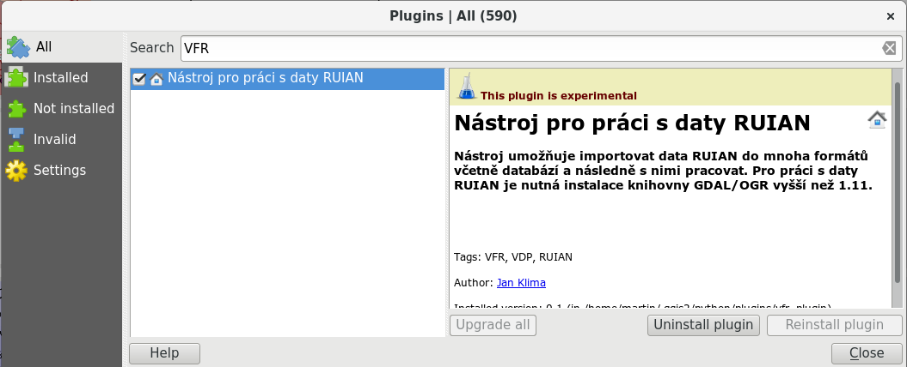

VFR plugin pro QGIS
===================

Cílem tohoto projektu je vytvoření pluginu pro QGIS, pomocí kterého by
bylo možné automaticky stahovat a spravovat prostorové data `RUIANU
<http://vdp.cuzk.cz/>`_. Grafické uživatelské rozhraní (GUI) by mělo
být navrženo tak, aby uživateli nabídlo jednoduchý výběr požadovaných
dat. Celý plugin bude implementován v programovacím jazyku Python s
podporou knihoven GDAL a PyQt. Druhou část projektu tvoří přepsaní
Python skriptů pro prácí s daty RUIANU do objektového modelu.

Tento projekt rozšiřuje verzi pluginu z akademického roku  2014/1015 (https://github.com/ctu-yfsg/2015-c-qgis-vfr)

Postup k instalaci
------------------

1. Do adresáře ``~/.qgis2/python/plugins`` naklonovat tento repositář:

::
      
   cd ~/.qgis2/python/plugins
   git clone https://github.com/ctu-yfsg/2016-c-qgis-vfr.git vfr_plugin

2. Do adresáře pluginu naklonovat repositář s knihovnou GDAL-VFR:

::
      
   cd vfr_plugin
   git clone https://github.com/ctu-osgeorel/gdal-vfr.git gdal_vfr

Návod k použití
---------------

Po instalaci plugin nejprve aktivujeme:

   
Autoři
------

- `Jan Klíma <https://github.com/janklima>`_
-  Lukáš Středa
-  Šimon Gajzler
