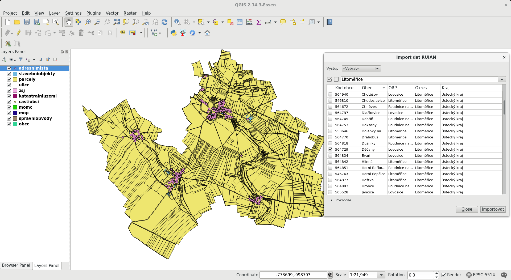

QGIS plugin pro práci s daty RUIÁN
==================================

Cílem projektu je vytvoření pluginu pro QGIS, pomocí kterého je možné
automaticky stahovat a spravovat prostorové data `RUIÁN
<http://vdp.cuzk.cz/>`_. Grafické uživatelské rozhraní (GUI) je
navrženo tak, aby uživateli nabídlo jednoduchý výběr požadovaných
dat. Plugin je implementován v programovacím jazyku Python s podporou
knihoven GDAL (http://gdal.org), resp. projektu GDAL-VFR
(https://github.com/ctu-osgeorel/gdal-vfr.git) a PyQt.

Projekt navazuje na semestrální projekty předmětu Free Software GIS
vyučovaného na Fakultě stavební ČVUT v Praze z akademického roku
2014/1015 (https://github.com/ctu-yfsg/2015-c-qgis-vfr) a 2015/2016
(https://github.com/ctu-yfsg/2015-c-qgis-vfr).

Postup pro instalaci
--------------------

1. Do adresáře ``~/.qgis2/python/plugins`` naklonovat tento repositář:

::
      
   cd ~/.qgis2/python/plugins
   git clone https://github.com/ctu-geoforall-lab/qgis-ruian-plugin.git ruian_plugin

2. Do adresáře pluginu naklonovat repositář s knihovnou GDAL-VFR:

::
      
   cd ruian_plugin
   git clone https://github.com/ctu-osgeorel/gdal-vfr.git gdal_vfr

Návod k použití
---------------

Po instalaci plugin nejprve aktivujeme:

.. image:: images/install.png

Vybereme obce, které chceme naimportovat:

.. image:: images/select.png

Data můžeme v QGISu rovnou zobrazit:

           
Autoři
------

- Jan Klíma
- Lukáš Středa
- Šimon Gajzler

Mentor
------

- Martin Landa
