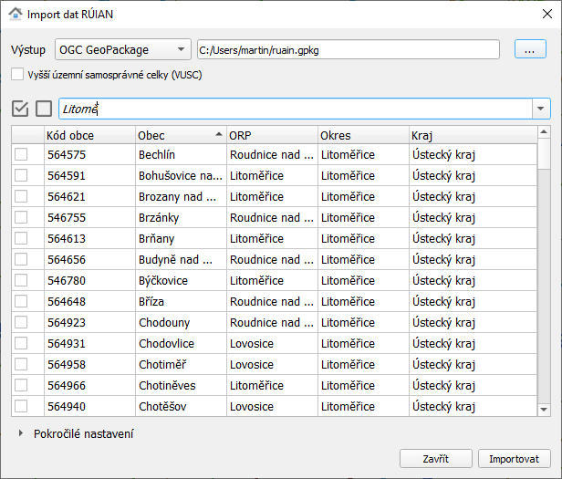

Zásuvný modul QGIS pro stahování datových vrstev RÚIAN
======================================================

Tento zásuvný modul QGIS umožňuje automaticky stahovat data **Registru
územní identifikace, adres a nemovitostí** (`RÚIAN
<http://ruian.cz>`__) dostupných v rámci `Veřejného dálkového přístupu
<http://vdp.cuzk.cz/>`__. Grafické uživatelské rozhraní je navrženo
tak, aby uživateli nabídlo jednoduchý výběr požadovaných dat. Plugin
je implementován v programovacím jazyku Python s podporou knihoven
`GDAL <http://gdal.org>`_, resp. projektu GDAL-VFR
(https://github.com/ctu-geoforall-lab/gdal-vfr.git) a PyQt.

Plugin je dostupný pro verze QGIS 2 a 3.

           
.. toctree::
   :maxdepth: 2

   instalace
   popis
   dodatek
