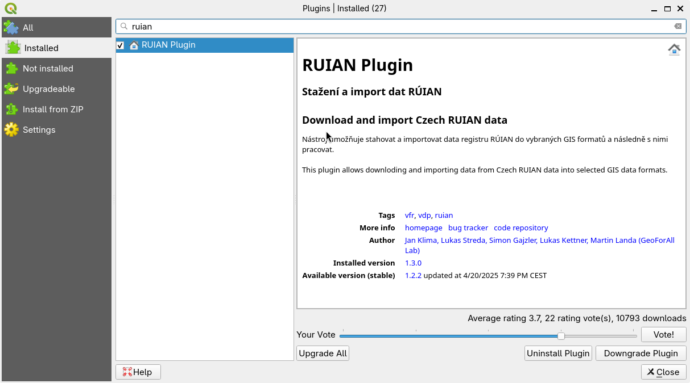

Instalace
---------

Plugin lze nainstalovat jako běžný zásuvný modul z menu ``Spravovat a instalovat zásuvné moduly``.

           
Po instalaci se v nástrojové liště QGIS objeví nová ikonka:

.. image:: images/icon.png
