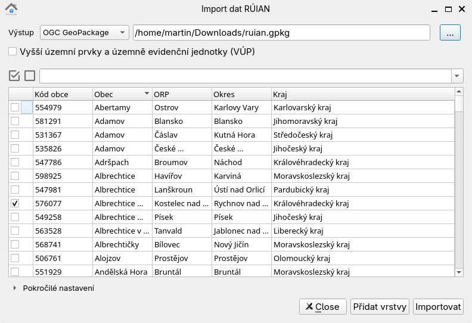
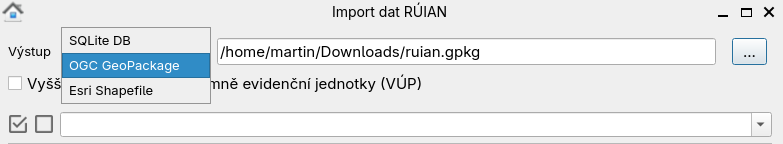
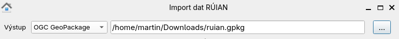
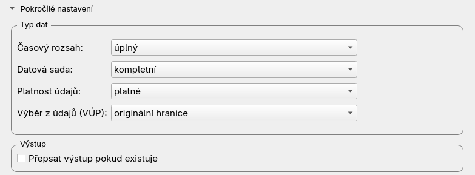
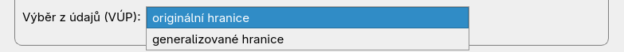
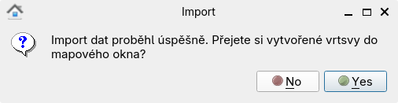
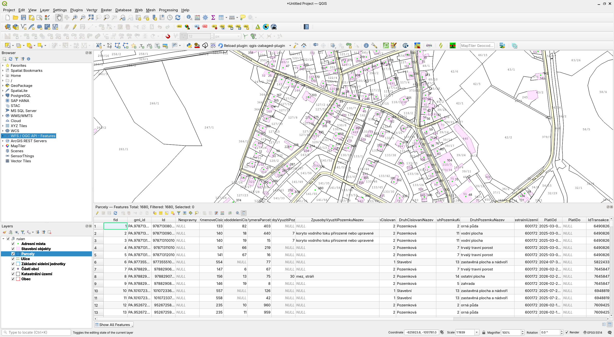

Návod k použití
---------------

Vybereme obec či obce, které chceme stáhnout:

   
   
Pokud je zaškrtnuto ``Vyšší uzemní prvky (VUP)``, budou staženy i
vyšší územní prvky (v hierarchii nad obcemi). Lze je stahovat
samostatně nebo i se zvolenou obcí.

.. important:: Je vhodné zvolit menší objem dat maximálně ve velikosti
             okresu. Zásuvný modul není navržen pro stahování většího
             objemu dat.

.. tip:: Vyhledávat lze podle názvu obce, obce s rozšířenou
   působností, okresu či kraje.
   
   .. figure:: images/select-type.gif
      :width: 600

V dalším kroku zvolíme formát výstupního souboru:

.. note:: V současné době zásuvný modul podporuje tři výstupní formáty:

          * `SQLite <https://gdal.org/drv_sqlite.html>`__
          * `OGC GeoPackage <https://gdal.org/drv_geopackage.html>`__
          * `Esri Shapefile <https://gdal.org/drv_shapefile.html>`__

   Podpora pro další formáty může být přidána na vyžádání.
          
Definujeme cestu k výstupnímu souboru, kam se uloží stažená data.
 

Možnost dalšího nastavení nalezneme pod rozbalovacím seznamem ``Pokročilé nastavení``.

Tady nalezneme možnost výběru generalizovaných hranic dat VÚP.

          
Data můžeme v QGISu rovnou zobrazit:

Příklad vizualizace stažených dat:

.. note:: Styly zobrazovaných prvků jsou téměř totožné jako na vizualizaci přes `vzdálený přístup od ČÚZK <https://vdp.cuzk.gov.cz/marushka/?ThemeID=1&InfoURL=https%3A%2F%2Fvdp.cuzk.gov.cz%2Fvdp%2Fruian>`__.

.. note:: Od měřítka 1:10000 se zobrazují ulice, adresní místa, parcely a stavební objekty, od 1:100000
          katastrální území a základní sídelní jednotky, od 1:200000 městské obvody a části a části obcí
          a od 1:500000 obce a městské a správní obvody Prahy. U všech prvků je též zobrazeno jejich jméno nebo číslo.

.. tip:: Již stažená data lze načíst z disku po zadání cesty k souboru a stisknutí tlačítka ``Přidat vrtsvy``.
