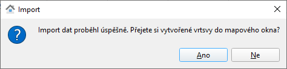

Návod k použití
---------------

Vybereme obec či obce, které chceme stáhnout:

.. image:: images/select.png
   :width: 600
   
   
Pokud je zaškrtnuto Data VUSC, budou staženy i vyšší územě správní celky. Lze je stahovat samostatně nebo i se zvolenou obcí.

.. important:: Je vhodné zvolit menší objem dat maximálně ve velikosti
             okresu. Zásuvný modul není navržen pro stahování většího
             objemu dat.

.. tip:: Vyhledávat lze podle názvu obce, obce s rozšířenou
   působností, okresu či kraje.
   
   .. figure:: images/select-type.png
      :width: 600

V dalším kroku zvolíme formát a cestu k výstupní souboru:

.. figure:: images/select-output.png
      :width: 600

.. note:: V současné době zásuvný modul podporuje tři výstupní
          formáty:

          * `SQLite <http://gdal.org/drv_sqlite.html>`__
          * `OGC GeoPackage <http://gdal.org/drv_geopackage.html>`__
          * `Esri Shapefile <http://gdal.org/drv_shapefile.html>`__

          Podpora pro další formáty může být přidána na vyžádání.
          
 Pro volbu cesty k výstupnímu souboru můžeme využít textového okna k zadání cesty či názvu a nebo grafické rozhraní.
 
.. figure:: images/select-storagelocation.png
      :width: 600
          
Data můžeme v QGISu rovnou zobrazit:

Příklad vizualizace stažených dat:

.. image:: images/visualization.png
   :width: 1000

.. note:: Od měřítka 1:2500 se zobrazují názvy ulic, od 1:1000
          parcelní čísla a domovní čísla u adresních bodů.
